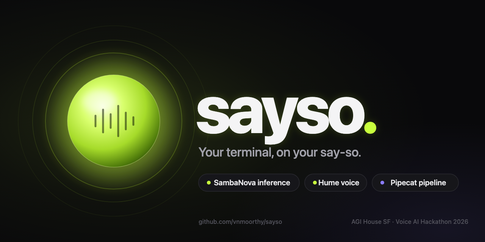
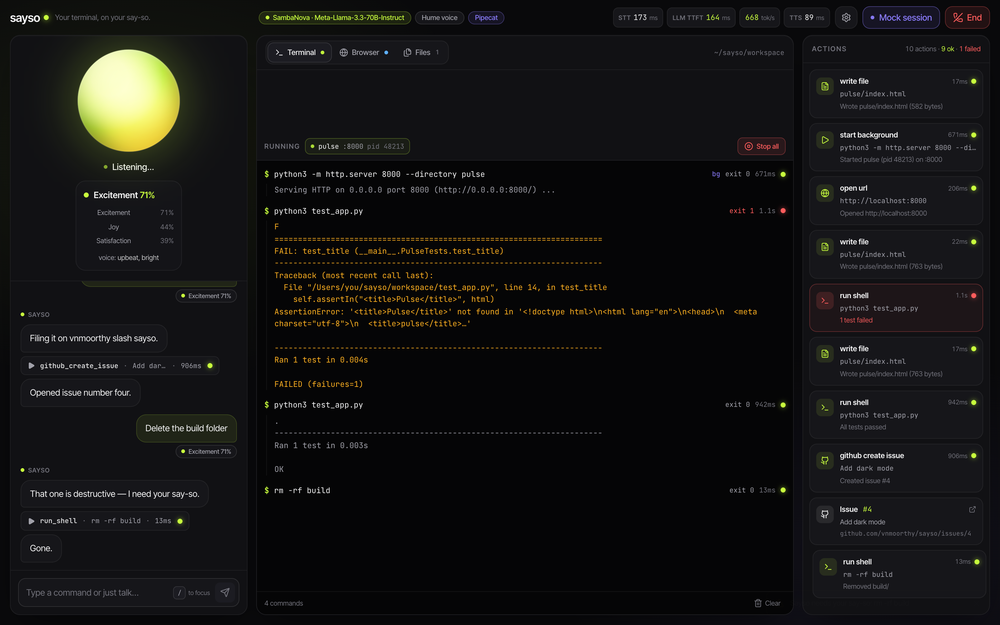
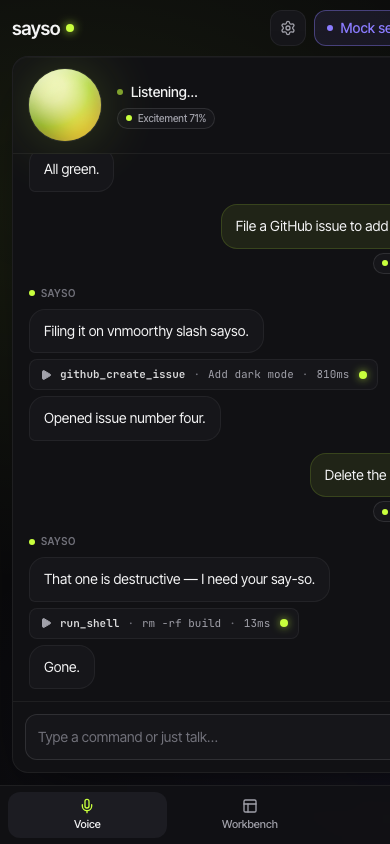
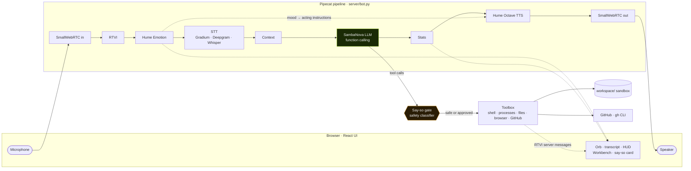
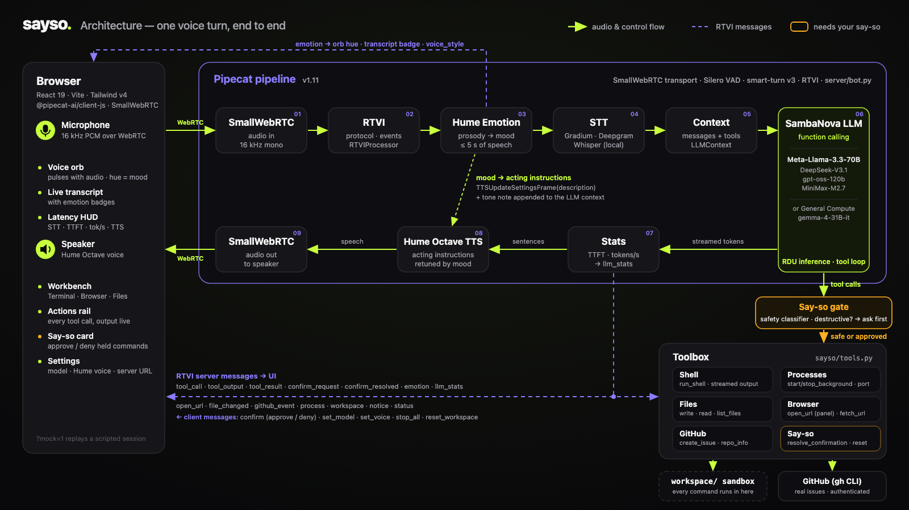

<p align="center">
  
</p>

<h1 align="center">Sayso</h1>

<p align="center">
  <strong>Your terminal, on your say-so.</strong><br>
  A voice-native developer agent: you talk, it operates your terminal, writes files, runs and serves projects, opens your browser, and files real GitHub issues.
</p>

<p align="center">
  <a href="https://www.python.org/"></a>
  <a href="https://github.com/pipecat-ai/pipecat"></a>
  <a href="https://sambanova.ai/"></a>
  <a href="https://www.hume.ai/"></a>
  <a href="LICENSE"></a>
  <a href="https://agihouse.ai/voiceaihackathon"></a>
  <a href="CONTRIBUTING.md"></a>
</p>

<p align="center">
  <a href="https://vnmoorthy.github.io/sayso/?mock=1"><strong>▶ Try the live mock (no install)</strong></a> ·
  <a href="#quickstart">Quickstart</a> ·
  <a href="#say-it--it-does-it">Examples</a> ·
  <a href="#architecture">Architecture</a> ·
  <a href="#configuration">Configuration</a> ·
  <a href="#safety-model">Safety</a> ·
  <a href="docs/ARCHITECTURE.md">Deep dive</a>
</p>

---

## What is Sayso

Sayso is a developer agent you operate with your voice. It runs on a [Pipecat](https://github.com/pipecat-ai/pipecat) pipeline: your speech goes in over WebRTC, a SambaNova-hosted model decides what to do and calls tools (shell, background processes, files, browser, GitHub), and the reply comes back in a Hume Octave voice whose acting instructions are retuned live from how *you* sound. Everything the agent does is rendered on screen as it happens, anything destructive is held for your say-so, and with zero API keys the whole thing still runs end-to-end on a bundled demo brain.

<p align="center">
  
</p>
<p align="center">
  
</p>

## Say it → it does it

| You say | What happens on screen |
| --- | --- |
| "Create a web app called **pulse** with a live clock and run it on port 8000" | `write_file` cards appear as `pulse/index.html` is written, a `start_background` process card shows the server coming up, the port is detected and the agent offers to open it. |
| "Open it in the browser" | `open_url` fires and the Workbench flips to the **Browser** tab with `http://localhost:8000` rendered inside the app. |
| "Ugh, the clock is tiny — make it huge and neon" | Hume expression measurement scores the frustration; the transcript badge turns *frustrated*, the orb hue shifts, the voice is retuned to "calm, warm, reassuring, unhurried", and the file is rewritten. |
| "Run the tests" | `run_shell` streams stdout/stderr line by line into the **Terminal** tab; the failing assertion is read out in plain words. |
| "Fix it" | The agent edits the file, re-runs the tests, and reports the green result in one sentence. |
| "File a GitHub issue to add dark mode" | `github_create_issue` runs through the authenticated `gh` CLI and a `github_event` card links to the real issue number. |
| "Delete the build folder" | `rm -rf build` is classified as destructive and parked on a **needs your say-so** card. Click *Approve*, or just say "yes". |

## Features

**Drives a real Chrome.** Say "open Hacker News", "search for the cheapest M4 MacBook", "click the second result", "type my name into the form", "scroll down", "what does the page say?" — Sayso operates its own Google Chrome through Playwright. Every browser tool returns the page as text plus a numbered list of clickable elements and inputs, so the model can chain search → open → read → fill out of the box, and each step streams a live screenshot into the app's Browser pane. Tools: `browser_open`, `browser_search`, `browser_click`, `browser_type`, `browser_press`, `browser_scroll`, `browser_back`, `browser_read`. Set `SAYSO_BROWSER_HEADLESS=0` to watch the Chrome window itself.


**Voice**
- Full-duplex, browser-to-server WebRTC audio via Pipecat's SmallWebRTC transport; Silero VAD and smart-turn v3 end-of-turn detection so you can speak naturally.
- STT from Gradium or Deepgram, with local Whisper (MLX on Apple Silicon) as a keyless fallback.
- A realistic voice with zero keys: **Kokoro** (54 local neural voices, runs faster than real time on Apple Silicon) is the default when there is no Hume key; Hume Octave takes over the moment you add one.
- Hold **Space** to talk while the mic is muted (push-to-talk for loud rooms); the Browser pane reloads in place when the agent rewrites the page it is showing.
- Replies spoken with Hume Octave TTS; pick a voice from Hume's library in Settings (default: *Ava Song*).

**Acts**
- Twelve tools the model can call: `run_shell` (live-streamed output), `start_background` / `stop_background` (dev servers with port detection), `write_file`, `read_file`, `list_files`, `open_url` (renders in the in-app browser panel), `fetch_url`, `github_create_issue` (real, via `gh`), `github_repo_info`, `resolve_confirmation`, `reset_workspace`.
- A Workbench with **Terminal | Browser | Files** tabs and an Actions rail, so every tool call is visible while the agent narrates it.

**Feels**
- Hume expression measurement (prosody model) scores up to 5 s of each utterance; 48 emotions collapse into 8 moods: neutral, calm, excited, happy, frustrated, stressed, confused, sad.
- Each mood maps to Octave acting instructions (frustrated → "calm, warm, reassuring, unhurried"; excited → "upbeat, bright, energetic") and a tone note for the LLM, so the reply *sounds* right and *reads* right.
- The orb changes hue with mood and the transcript carries emotion badges.

**Fast**
- Inference on SambaNova RDUs, default `Meta-Llama-3.3-70B-Instruct`, switchable in the UI to `DeepSeek-V3.1`, `gpt-oss-120b`, `MiniMax-M2.7`; or General Compute's `gemma-4-31B-it`.
- A latency HUD shows STT time, LLM time-to-first-token, tokens/sec and TTS time for every turn, measured live.

**Safe**
- Every command is classified before it runs; destructive patterns are held and surfaced as a say-so card you approve by click or by voice.
- All work happens inside a sandboxed `workspace/` directory; paths that escape it are held too.

**Works offline**
- No keys at all: a bundled rule-based demo brain (a local OpenAI-compatible server), local Whisper and browser speech synthesis run the full pipeline end-to-end.
- `?mock=1` in the web app replays a scripted session with no server at all.

## Architecture





One voice turn, end to end: audio arrives over WebRTC → the RTVI processor bridges protocol messages → the Hume emotion processor buffers the utterance and scores its prosody → STT transcribes → the context aggregator assembles messages plus the tool schema → the SambaNova model streams text and function calls → the stats processor measures TTFT and tokens/sec → Hume Octave speaks the reply → audio returns over WebRTC. Tool calls pass through the say-so gate into the toolbox, and every tool, the emotion processor and the stats processor stream RTVI server messages back to the UI. The full processor list, event contract and state machines are in [docs/ARCHITECTURE.md](docs/ARCHITECTURE.md).

## Why silicon speed matters for voice

A spoken conversation has a budget. If the reply does not start within roughly a second of you finishing a sentence, it stops feeling like a conversation and starts feeling like a form. Two numbers decide whether a voice agent stays inside that budget:

- **Time to first token (TTFT)** sets the earliest moment the first sentence can be handed to TTS. Everything before it is silence.
- **Tokens per second** sets how quickly the rest of the reply, and every tool call, streams out. Speech is consumed at a fixed pace, so once generation outruns speech the model is effectively free; below it, the voice stutters.

Tool-heavy turns make throughput matter more than chat does. Writing a file means emitting the entire file as JSON arguments before a single word can be spoken, and a real task ("create it, serve it, open it") chains several tool calls, each one a full model round trip that includes the growing context. Latency compounds across the chain; throughput is what keeps the chain short. Sayso runs on SambaNova RDU inference for exactly this reason, and rather than quote numbers here, it shows them: the HUD reports STT ms, TTFT, tokens/sec and TTS ms for every turn, live.

## Stack

| Layer | Tech | Why |
| --- | --- | --- |
| Orchestration | [Pipecat 1.11](https://github.com/pipecat-ai/pipecat) | Frame-based real-time pipeline, function calling, RTVI protocol, observers and metrics out of the box. |
| Transport | SmallWebRTC (Pipecat `webrtc` extra · `@pipecat-ai/small-webrtc-transport`) | Browser-to-Python WebRTC with no media server to deploy. |
| Turn-taking | Silero VAD · smart-turn v3 | Local, fast speech detection and end-of-turn prediction. |
| STT | Gradium · Deepgram · Whisper (MLX / faster-whisper) | Sponsor-credit streaming STT, with a fully local fallback. |
| LLM | SambaNova (`Meta-Llama-3.3-70B-Instruct`, DeepSeek-V3.1, gpt-oss-120b, MiniMax-M2.7) · General Compute (`gemma-4-31B-it`) | Conversation-speed inference with function calling; OpenAI-compatible so providers swap by env var. |
| Voice | Hume Octave TTS | Expressive speech with natural-language acting instructions that can change mid-session. |
| Emotion | Hume expression measurement (prosody, streaming) | Hear *how* the user said it, not just what. |
| Tools | `asyncio` subprocesses · `httpx` · `gh` CLI | Real actions with live streamed output. |
| Web app | React 19 · Vite · Tailwind v4 · framer-motion · `@pipecat-ai/client-js` · `@pipecat-ai/small-webrtc-transport` | Fast, animated, typed against a shared event contract (`web/src/lib/protocol.ts`). |
| Server | Python 3.12 · `uv` · loguru · FastAPI (demo brain) | Reproducible installs, one command to run. |

## Quickstart

**One command** (creates `server/.env` from the example, installs, runs the pre-flight, and starts both processes):

```bash
git clone https://github.com/vnmoorthy/sayso && cd sayso && ./dev.sh
```

Then open <http://localhost:5173>, press **Connect**, and talk. Or step by step:

Prerequisites: Python 3.12 with [`uv`](https://docs.astral.sh/uv/), Node 20+, and the [`gh` CLI](https://cli.github.com/) logged in if you want voice-filed issues.

```bash
git clone https://github.com/vnmoorthy/sayso && cd sayso

# server
cd server && cp .env.example .env   # add SAMBANOVA_API_KEY, HUME_API_KEY, GRADIUM_API_KEY (all optional)
uv sync && uv run bot.py            # http://localhost:7860

# web (new terminal)
cd web && npm install && npm run dev   # http://localhost:5173  → Connect → talk
```

Open the web app, press **Connect**, allow the microphone, and say: *"Create a web app called pulse with a live clock and run it on port 8000."*

No keys? Skip the `.env` step. The server starts the demo brain, transcribes with local Whisper and the browser speaks the replies; the UI is fully exercisable.

## Configuration

All settings are environment variables read by `server/sayso/config.py`; anything missing falls back gracefully (see `server/.env.example`).

| Variable | Default | What it does |
| --- | --- | --- |
| `SAMBANOVA_API_KEY` | – | Enables SambaNova inference (the hackathon default provider). |
| `SAYSO_MODEL` | `Meta-Llama-3.3-70B-Instruct` | Model to use with the selected provider; switchable live from Settings. |
| `GENERAL_COMPUTE_API_KEY` | – | Uses General Compute (`https://api.generalcompute.com/v1`, `gemma-4-31B-it`) when no SambaNova key is set. |
| `OPENAI_API_KEY` | – | Uses OpenAI (or any OpenAI-compatible endpoint via `OPENAI_BASE_URL`). |
| `SAYSO_LLM_PROVIDER` | auto | Force `sambanova`, `general_compute`, `openai` or `demo` instead of auto-detecting from keys. |
| `HUME_API_KEY` | – | Enables Hume Octave TTS and expression measurement. Without it the browser speaks. |
| `HUME_VOICE_ID` | – | Pin a specific Hume voice id. |
| `HUME_VOICE_NAME` | `Ava Song` | Voice resolved from the Hume voice library when no id is set. |
| `SAYSO_EMOTION` | `1` | Set `0` to disable prosody scoring while keeping Hume TTS. |
| `GRADIUM_API_KEY` | – | Streaming STT via Gradium (hackathon sponsor credits). |
| `DEEPGRAM_API_KEY` | – | Streaming STT via Deepgram. |
| `SAYSO_WHISPER_MODEL` | `whisper-large-v3-turbo-q4` (MLX) / `distil-medium.en` | Local Whisper model used when no STT key is set. |
| `SAYSO_GITHUB_REPO` | – | `owner/name` that voice-filed issues go to (`gh` must be logged in). |
| `SAYSO_WORKSPACE` | `./workspace` | Sandbox directory the agent works in. |
| `SAYSO_OPEN_SYSTEM_BROWSER` | `0` | `1` also opens URLs in your real browser, not just the in-app panel. |
| `SAYSO_SHELL_TIMEOUT` | `90` | Seconds before a `run_shell` command is killed. |
| `SAYSO_FAKE_EMOTION` | `0` | `1` simulates moods from loudness when there is no Hume key (UI testing only; events are flagged `simulated`). |

Web app: `VITE_SAYSO_SERVER_URL` (default `http://localhost:7860`) or change the server URL in Settings.

## Safety model

Sayso acts for real, so it asks before it hurts.

1. **Classify.** Every `run_shell` and `start_background` command goes through `classify_command()` in `server/sayso/tools.py` before it executes. Patterns that are held: recursive or forced `rm`, `rmdir`, `sudo`/`doas`, `git push --force`, `git reset --hard` / `git clean -f`, disk operations (`mkfs`, `dd if=`, `fdisk`, `diskutil`), writes to `/dev/`, `kill`/`pkill`/`killall`, `shutdown`/`reboot`, fork bombs, recursive `chmod`/`chown`, `curl … | sh`, package publishing, `docker rm/rmi/system prune`, `find -delete`, `truncate`/`shred`, and any path that escapes the workspace (`/Users`, `/etc`, `~`, `..`, and friends).
2. **Hold.** A held command is not run. The tool returns `awaiting_confirmation` to the model and emits a `confirm_request` event, which the UI renders as a **needs your say-so** card with the exact command and the reason.
3. **Ask.** The agent tells you what it wants to run and asks for a yes.
4. **Resolve.** You click *Approve*/*Deny*, or say "yes"/"no" and the agent calls `resolve_confirmation`. Only then does the command run, with its output streamed like any other. Denied commands run nothing.
5. **Contain.** Everything executes with `cwd=workspace/`; `write_file`, `read_file` and `list_files` refuse paths outside it; `reset_workspace` is itself a held action. Background processes are stopped when the client disconnects.

The classifier is a guardrail, not a sandbox: it runs commands as your user on your machine. Treat `workspace/` as disposable and review the say-so card before approving.

## Project structure

```
sayso/
├── server/                     # Pipecat voice agent (Python 3.12, uv)
│   ├── bot.py                  # pipeline: WebRTC → RTVI → Hume emotion → STT → context → SambaNova LLM (+tools) → stats → Hume TTS → WebRTC
│   ├── sayso/config.py         # env-driven provider selection (live vs demo)
│   ├── sayso/tools.py          # toolbox + safety classifier + background process manager
│   ├── sayso/emotion.py        # Hume prosody streaming → mood → TTS acting instructions + LLM tone note
│   ├── sayso/stats.py          # TTFT / tokens-per-second telemetry
│   ├── sayso/bus.py            # forwards custom server messages to the client over RTVI
│   ├── sayso/demo_llm_server.py# keyless OpenAI-compatible demo brain
│   ├── sayso/prompts.py        # system prompt
│   └── .env.example
├── web/                        # React UI (Vite)  src/lib/protocol.ts is the shared event contract
├── workspace/                  # sandbox the agent works in
├── docs/                       # this documentation + assets + slide deck (deck/Sayso.pptx added later)
│   ├── ARCHITECTURE.md
│   └── assets/
└── .claude/launch.json         # one-click dev servers
```

## Demo mode and mock mode

**Free-form conversation needs a real model.** Without an LLM key Sayso runs a rule-based demo brain that understands the demo script plus generic browser commands (open/search/click/type/scroll/read). Add `GENERAL_COMPUTE_API_KEY` (free hackathon credits), `SAMBANOVA_API_KEY`, or `OPENAI_API_KEY` for open-ended tasks, or point `LOCAL_LLM_URL` at a local OpenAI-compatible server such as `uv run python -m mlx_lm.server --model mlx-community/Qwen2.5-7B-Instruct-4bit --port 8081`.

**Prove the voice loop without a microphone:** `cd server && uv run scripts/voice_e2e.py` streams six spoken utterances (synthesised with macOS `say`) into the running server over WebRTC exactly like the browser does, and reports the transcript, the tool calls, the spoken reply and whether voice audio came back.

**Demo mode (server, no keys).** When no LLM key is present, `bot.py` starts `sayso/demo_llm_server.py`: a small FastAPI app on `127.0.0.1:7861` that speaks the OpenAI chat-completions protocol (streaming, tool calls and usage included) and answers with a rule-based script. It understands the demo flow — scaffold an app, serve it, open it, run the tests, fix them, restyle it, file an issue, delete something (which triggers the say-so card) — and it reads the same tone notes the real model gets, so "Ugh, this is broken" earns a "Sorry about that." Pipecat's OpenAI service is pointed at it, so tool calls, streaming, confirmations and every UI event are exercised for real. Add a key and the real model takes over with the same tools. `SAYSO_FAKE_EMOTION=1` additionally simulates moods from loudness when there is no Hume key; those events carry `simulated: true`.

**Mock mode (web, no server).** Open `http://localhost:5173/?mock=1` to replay a scripted session inside the app (transcript, tool cards, emotion and HUD events) with no backend at all. Useful for UI work, screenshots and demos on a plane.

## Hackathon

**Demo video:** [`docs/video/Sayso-demo.mp4`](docs/video/Sayso-demo.mp4) (screen recording of the live app; rebuild with `docs/video/record.py` + `assemble.sh`) · **Pitch deck:** [`docs/deck/Sayso.pptx`](docs/deck/Sayso.pptx) · **3-minute demo storyboard:** [`docs/DEMO_STORYBOARD.md`](docs/DEMO_STORYBOARD.md) · **Live mock:** <https://vnmoorthy.github.io/sayso/?mock=1>

Built at the **AGI House SF Voice AI Hackathon**, September 19, 2026 — [agihouse.ai/voiceaihackathon](https://agihouse.ai/voiceaihackathon).

- **Track 2 — Voice-controlled software: from the terminal to the browser.** Sayso operates the terminal, files, dev servers and an in-app browser by voice.
- **Track 1 — Agents that act.** Real side effects: processes started, files written, GitHub issues filed, each gated by a safety classifier.
- **Sponsors used:** SambaNova (inference), General Compute (alternate inference), Hume (Octave TTS and expression measurement), Gradium (STT). Infinity sponsored the event.
- **Framework:** Pipecat.

## Roadmap

- Phone-in via Twilio, so Sayso answers a call and works the terminal while you drive.
- Unitree Go2 robot voice control through the same toolbox pattern.
- Multi-agent dispatch: hand long tasks to sub-agents and keep the voice channel free.
- Pipecat Cloud deploy for a hosted, shareable instance.
- VS Code extension: the Workbench inside the editor, say-so cards in the sidebar.

## Contributing

Issues and PRs are welcome. See [CONTRIBUTING.md](CONTRIBUTING.md) for dev setup, code style and how to add a tool in three edits.

## License

[MIT](LICENSE) © 2026 V N Moorthy

## Acknowledgements

- [Pipecat](https://github.com/pipecat-ai/pipecat) by Daily, for the pipeline, the RTVI protocol and the transport.
- [SambaNova](https://sambanova.ai/) for RDU inference that makes tool-heavy voice turns conversational.
- [Hume](https://www.hume.ai/) for Octave TTS and expression measurement.
- [General Compute](https://generalcompute.com/) for alternate inference.
- [Gradium](https://gradium.ai/) for streaming STT credits.
- [AGI House](https://agihouse.ai/) for hosting the hackathon.
